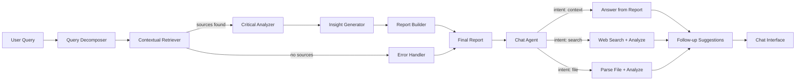

# 🔬 Deep Researcher

**Multi-Agent AI Research Assistant** — performs multi-hop investigations across web sources and news articles using coordinated AI agents orchestrated by LangGraph.

New in v2.0: **Conversational Follow-up** & **Live Attachment Analysis**.

---

## Architecture



| Agent | Role | Model Tier |
|-------|------|-----------|
| **Query Decomposer** | Breaks topic into 3-5 focused sub-questions | Low-cost |
| **Contextual Retriever** | Fetches web sources via Tavily API | — |
| **Critical Analyzer** | Summarises, scores credibility, finds contradictions | Low-cost |
| **Insight Generator** | Produces hypotheses, trends, research gaps | High-reasoning |
| **Report Builder** | Compiles structured Markdown report + BibTeX | Low-cost |
| **Chat Agent** (NEW) | Classifies intent (context/search/file) & synthesizes answers | Free / Low-cost |
| **Follow-up Agent** (NEW) | Suggests 3 relevant follow-up questions | Free |

## Quick Start

### 1. Clone & enter
```bash
git clone <repo-url>
cd deep-researcher
```

### 2. Create virtual environment
```bash
python -m venv .venv
# Windows
.venv\Scripts\activate
# macOS/Linux
source .venv/bin/activate
```

### 3. Install dependencies
```bash
pip install -r requirements.txt
```

### 4. Configure API keys
Create a `.env` file:
```env
OPENROUTER_API_KEY=sk-or-v1-your-key-here
TAVILY_API_KEY=tvly-your-key-here
```

### 5. Run
```bash
streamlit run app.py
```
Opens at **http://localhost:8501**.

---

## Features

### 🧠 Deep Research
- **Multi-hop Search**: Breaks down complex topics into sub-queries.
- **Academic & Web Sources**: define scope (e.g. last 2 years).
- **Contradiction Detection**: Highlights conflicting information.
- **Insight Generation**: Hypotheses and future trends.

### 💬 Conversational Follow-up (NEW)
- **Chat with Report**: Ask questions about specific findings.
- **Live Attachment Analysis**: Upload new PDFs mid-conversation.
- **Smart Suggestions**: 3 auto-generated follow-up questions.
- **Source Badges**: See if an answer came from the report, web search, or file analysis.

## Project Structure

```
deep-researcher/
├── app.py                    # Streamlit UI (with Chat Interface)
├── agents/
│   ├── orchestrator.py       # LangGraph pipeline coordinator (Research + Chat)
│   ├── chat_agent.py         # Conversational logic (classify/answer)
│   ├── followup_agent.py     # Suggestion generator
│   ├── query_decomposer.py   # Agent 1
│   ├── retriever.py          # Agent 2
│   ├── analyzer.py           # Agent 3
│   ├── insight_generator.py  # Agent 4
│   └── report_builder.py     # Agent 5
├── utils/
│   ├── guardrails.py         # Safety & cost controls
│   ├── llm_client.py         # OpenRouter API wrapper
│   ├── tavily_client.py      # Tavily search wrapper
│   ├── cost_tracker.py       # Real-time LLM cost estimation
│   ├── document_parser.py    # PDF/DOCX/image upload parser
│   └── pdf_generator.py      # Report → PDF export
├── config/
│   └── models.py             # Model tiers, pricing, constants
├── FLOW.md                   # 14-step user flow documentation
├── requirements.txt
└── .env                      # API keys (not committed)
```

## Environment Variables

| Variable | Required | Description |
|----------|----------|-------------|
| `OPENROUTER_API_KEY` | ✅ | OpenRouter API key for LLM calls |
| `TAVILY_API_KEY` | ✅ | Tavily API key for web search |

## Export Formats

- **Markdown** — full structured report
- **PDF** — professional layout with title page and page numbers
- **BibTeX** — machine-readable citations

## License

MIT
